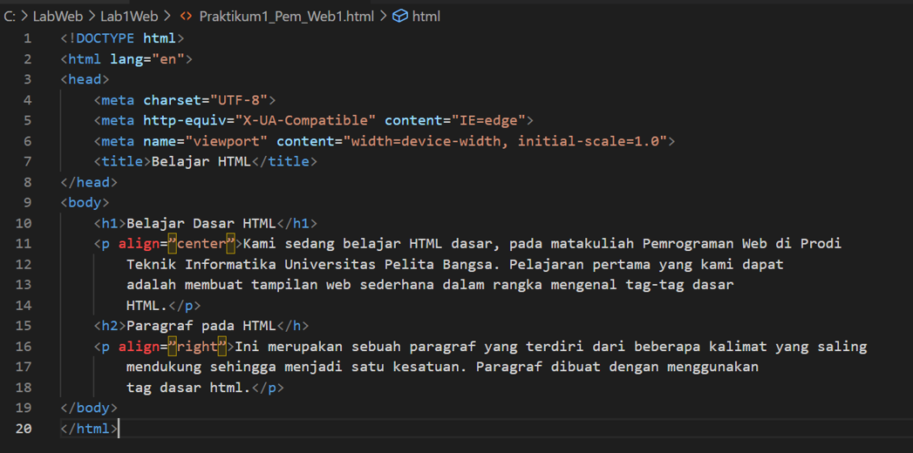

# Praktikum_Lab1Web1
## Belajar Tag Dasar HTML

### Memebuat Paragraf
Kode Tag untuk paragraf adalah '
'
Ini adalah tampilannya

Ini adalah tampilan paragraf pada Browser

#### Menambahkan Judul
ini adalah tampilan programnya

ini adalah tampilan Heading 1 dan Heading 2

##### Memformat teks
Ini adalah tampilan programnya

ini adalah tampilan pada browser. karena saya menggunakan kode tag '<i>' pada Kalimat pemrograaman web jadi hasilnya menjadi teks miring, sedangkan saya menggunakan kode tag '<mark>' padda kalimat Membuat tampilan web sederhana jadi hasilnya markah kuning.

###### Menyisipkan Gambar
Untuk menyisipkan gambar, siapkan gambar yang akan disisipkan pada halaman web, kemudian 
simpan file gambar tersebut satu folder dengan file dokumen html. Atau bisa juga menyisipkan 
gambar dari website external.

ini adalah tampilan programnya

ini adalah tampilan browsernya

Menambahkan Hyperlink. Untuk menambahkan link berikut contoh kode tagnya

berikut tampilan browser setelah kita menyisipkan link

Sekian tugas yang saya kerjakan. Semoga membantu, Terimakasih